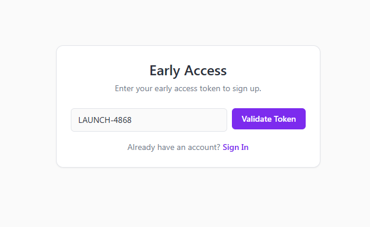
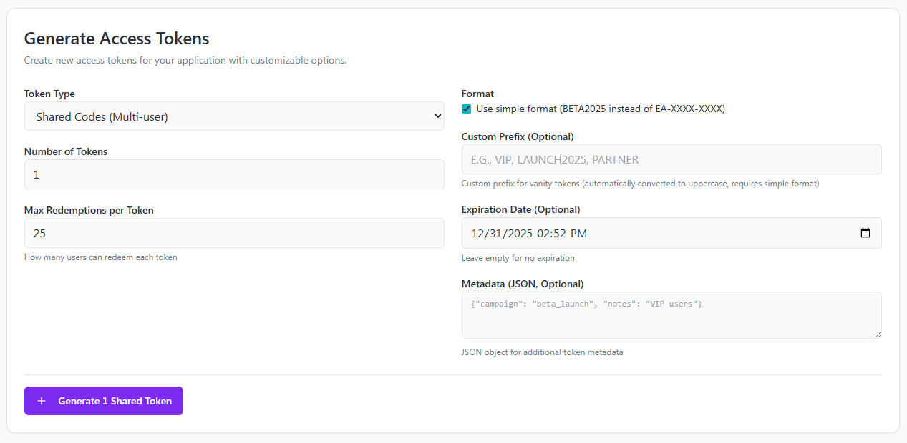

# Early Access Token System

A modular early access token system for TypeScript web applications. This system provides controlled access to beta features, private content, or limited releases through unique token codes. It is designed for use with a Supabase database.



*Generate and hand out tokens to provide limited early access to users to your new project or to allow access to new features.*

## Features

- **Secure Token Generation**: Cryptographically secure token generation with collision resistance
- **Vanity Token Naming**: Custom prefixes for branded, memorable token codes
- **Database-Backed**: Full audit trail of token creation, distribution, and redemption
- **Admin Management**: Sample interface for token generation and management you can use for implementation in your project
- **Supabase Integration**: Seamless integration with existing Supabase authentication
- **Extensible Design**: Built for future enhancements like expiration, usage limits, and revocation



*Supports advanced features including vanity prefixes, expiration dates, metadata support, detailed lifecycle information.*

## Installation

```bash
npm install ../earlyaccess_tokensys
```

Or for monorepo development:
```bash
npm install
cd ../your_app
npm install ../earlyaccess_tokensys
```

## Database Setup

Run the complete database migration to create the required tables with all features:

**📁 Use the complete schema file:** `src/db/schema.sql`

This file includes:
- ✅ Full table structure with shared token support
- ✅ Performance indexes for all query patterns
- ✅ Row Level Security (RLS) policies
- ✅ Documentation comments

**To set up the database:**
1. Open your Supabase SQL editor
2. Run the contents of `src/db/schema.sql`
3. Verify the table and indexes are created

## Token Types

### Unique Codes (1 user per code)
- **Format**: `EA-A1B2C3D4-0001` (complex, secure)
- **Usage**: One-time redemption per code
- **Use case**: Individual invitations, precise tracking

### Shared Codes (N users per code)
- **Format**: `BETA2025` (simple, shareable)
- **Usage**: Multiple users can redeem the same code
- **Use case**: Group access, classroom sharing, viral distribution

### Vanity Codes (Custom prefixes)
- **Format**: `VIP1234`, `LAUNCH2025001`, `PARTNER0001` (branded, memorable)
- **Usage**: Custom prefixes for marketing campaigns, partner programs, or branded access
- **Use case**: Event promotions, partner programs, VIP access, themed campaigns

## Usage

### Generate Shared Codes

```typescript
import { createTokenService } from 'earlyaccess-tokensys';

// Generate 5 shared codes, each usable by 25 people
const sharedTokens = await tokenService.generateTokenBatch({
  count: 5,
  shared_code: true,
  max_redemptions: 25, // Each code can be used by 25 people
  simple_format: true   // Use BETA2025 format instead of EA-XXXX-XXXX
});
```

### Generate Unique Codes

```typescript
// Generate unique codes (1 user each)
const uniqueTokens = await tokenService.generateTokenBatch({
  count: 10,
  max_redemptions: 1, // Each code can only be used once
  simple_format: false // Use complex EA-XXXX-XXXX format
});
```

### Generate Vanity Tokens with Custom Prefixes

```typescript
// Generate branded shared codes with custom prefix
const vipTokens = await tokenService.generateTokenBatch({
  count: 5,
  shared_code: true,
  max_redemptions: 50, // Each code can be used by 50 people
  custom_prefix: 'VIP'   // Use "VIP" instead of random prefixes
});
// Results in tokens like: VIP1234, VIP5678, VIP9012, etc.

// Generate event-specific codes
const eventTokens = await tokenService.generateTokenBatch({
  count: 3,
  shared_code: true,
  max_redemptions: 100,
  custom_prefix: 'LAUNCH2025'
});
// Results in tokens like: LAUNCH2025001, LAUNCH2025002, LAUNCH2025003, etc.

// Generate partner codes
const partnerTokens = await tokenService.generateTokenBatch({
  count: 2,
  max_redemptions: 25,
  custom_prefix: 'PARTNER'
});
// Results in tokens like: PARTNER0001, PARTNER0002, etc.
```

### Token Validation

```typescript
import { validateToken } from 'earlyaccess-tokensys';

const result = await validateToken('BETA2025');
if (result.valid) {
  const token = result.token!;
  console.log(`Token allows ${token.max_redemptions - token.current_redemptions} more redemptions`);
  console.log('Users who redeemed:', token.redeemed_users);
}
```

### Token Generation

```typescript
import { generateToken } from 'earlyaccess-tokensys';

const token = await generateToken();
console.log('Generated token:', token.code); // "EA-X9Y8Z7W6-0001"
```

### React Component Integration

```tsx
import { TokenInput } from 'earlyaccess-tokensys';

function SignupForm() {
  return (
    <form>
      <TokenInput onTokenValidated={(token) => console.log('Valid token:', token)} />
      {/* Rest of signup form */}
    </form>
  );
}
```

### Admin Component Integration

```tsx
import { TokenAdmin } from 'earlyaccess-tokensys';

function AdminDashboard() {
  return (
    <div>
      <h1>Token Management</h1>
      <TokenAdmin
        supabaseUrl="/api/early-access"
        onError={(error) => console.error('Admin error:', error)}
      />
    </div>
  );
}
```

## API Endpoints

### Validate Token
```
POST /api/early-access/validate
Content-Type: application/json

{
  "tokenCode": "EA-A1B2C3D4-0001"
}
```

Response:
```json
{
  "valid": true,
  "token": {
    "id": "uuid",
    "code": "EA-A1B2C3D4-0001",
    "created_at": "2025-10-17T10:00:00Z",
    "is_active": true
  }
}
```

## Development

```bash
# Install dependencies
npm install

# Run tests
npm test

# Build
npm run build

# Type checking
npm run type-check
```

## Quick Start

1. **Install**: `npm install ../earlyaccess-tokensys`
2. **Setup Database**: Run the SQL in `src/db/schema.sql` in Supabase
3. **Create API Routes**: See `SETUP.md` for complete integration guide
4. **Update Signup**: Use `TokenInput` component in your signup flow

## Features

- ✅ **Flexible Token Types**: Support for unique codes (1 user), shared codes (N users), and vanity codes
- ✅ **Multiple Formats**: Complex format (EA-A1B2C3D4-0001), simple format (BETA2025), and custom vanity formats
- ✅ **Vanity Token Naming**: Custom prefixes for branded, memorable token codes
- ✅ **Secure Token Generation**: Collision-resistant generation with uniqueness checks
- ✅ **Database-Backed**: Full audit trail with Supabase and RLS policies
- ✅ **Rate Limiting**: Built-in protection against abuse
- ✅ **Admin Component**: React component for token management interfaces
- ✅ **React Components**: Ready-to-use UI components
- ✅ **TypeScript**: Full type safety and IntelliSense
- ✅ **Modular Architecture**: Easy to extend and customize

## Architecture

- **Modular Design**: Standalone module that can be easily integrated
- **Database First**: All token state managed in Supabase
- **Security Focused**: Server-side validation, rate limiting, RLS policies
- **Scalable**: Built to handle thousands of tokens and users

## License

MIT
